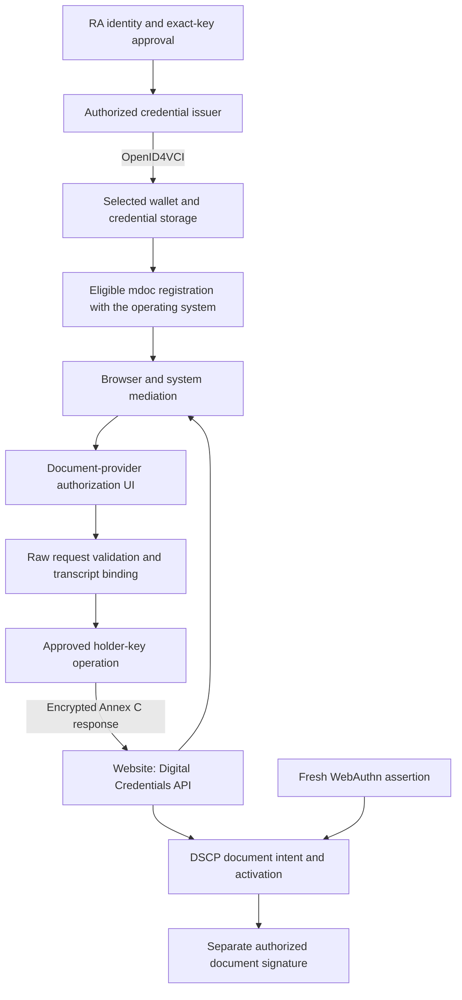

# Apple IdentityDocumentServices Integration

This document maps Apple's system-mediated mdoc presentment interfaces to DTI, DCP, DSCP and PRF-KPP in the `certconcord-governed-draft-02` composition. Platform availability, protocol selection and document-type eligibility are explicit deployment capabilities. The adopted documentation is identified in `source-lock.json`. The [framework evolution contract](../spec/bindings/FRAMEWORK-draft-02.md) defines holder roles independently of any wallet ecosystem. Apple system mediation is one selected interface; neither it nor an EUDI architecture is a universal dependency.

## System role and placement

[IdentityDocumentServices](https://developer.apple.com/documentation/identitydocumentservices) connects document-provider applications to browser-mediated credential requests. It supplies discovery, registration and request/response interfaces; the application supplies credential storage, issuer policy and document operations. Its companion UI framework supplies provider authorization and browser presentment interfaces.

The framework is available on iOS, iPadOS and macOS 26. Availability is determined per symbol: the documented [MobileDocumentRegistration](https://developer.apple.com/documentation/identitydocumentservices/mobiledocumentregistration) and [provider request context](https://developer.apple.com/documentation/identitydocumentservicesui/iso18013mobiledocumentrequestcontext) list iOS/iPadOS support. Framework availability on macOS does not establish that a macOS application can use every provider-extension interface.

Issuance, mediation, key custody and document signing retain separate contracts. The native key provider's generation/signing interface remains the DCP/DSCP cryptographic boundary. Installing an application or registering a document does not create a CA approval or grant document-signing authority.

## Document types and issuer policy

The [mobile-document-provider entitlement](https://developer.apple.com/documentation/bundleresources/entitlements/com.apple.developer.identity-document-services.document-provider.mobile-document-types) enumerates mDL, Photo ID, EUDI PID, EU age-verification and Japan MyNumber types. The selected identifiers include `org.iso.18013.5.1.mDL`, `org.iso.23220.photoid.1` and `eu.europa.ec.eudi.pid.1`. Registration must match the application's actual entitlement.

RRA custom document types remain valid protocol choices under their own rulebooks. A custom type's availability through this Apple system interface requires the corresponding platform entitlement and capability; a free-form Swift string is insufficient evidence of that support. A deployment MUST NOT label a standalone RRA signer credential as mDL or PID merely to obtain a platform route. A combined identity/signing mdoc requires the actual issuer to authorize both namespaces under the applicable ecosystem rules.

Registrations associate a local document identifier, document type, invalidation date and supported trust identifiers. `supportedAuthorityKeyIdentifiers` identifies accepted relying-party authorizers. `supportedIssuerKeyIdentifiers` identifies the document's issuer chain. These select different trust relationships and MUST NOT be merged with the holder public key or document-signing SPKI. The registration is routing metadata; RRA verification still applies current issuer, reader, status and key-binding policy.

## Provider lifecycle and request handling

Apple's [provider integration guide](https://developer.apple.com/documentation/identitydocumentservices/implenting-as-an-identity-document-provider) defines registration plus an app extension with application-provided authorization UI. User permission controls registration. The provider reconciles registrations after authorization changes and removes unavailable documents.

The guide describes a two-stage request: a system-parsed view for initial disclosure review, followed by the raw request within `sendResponse` after user authorization. The provider compares both representations, independently verifies the raw request and trusted reader certificates, and builds the encrypted response. System preprocessing does not replace that validation.

RRA integration applies the following state order:

1. Resolve the selected registration to the stored credential and current DeviceBinding.
2. Review the requesting origin, credential type, requested attributes and retention intent.
3. After disclosure authorization, compare the system-parsed request with the raw request, including document/namespace selection and reader authority.
4. Validate the exact selected protocol transcript, encryption parameters, freshness and current credential/key status.
5. Execute only the permitted holder operation, then return the encrypted response through the active request context.
6. Record completion or cancellation without granting authority to another session or document operation.

Parsed document requests expose [document type, namespaces and issuer-key identifiers](https://developer.apple.com/documentation/identitydocumentservices/iso18013mobiledocumentrequest/documentrequest). Element metadata identifies [retention intent](https://developer.apple.com/documentation/identitydocumentservices/iso18013mobiledocumentrequest/elementinfo). These fields participate in consent and consistency checking; they do not authenticate an arbitrary document-signing instruction.

## Transport and version selection

Apple's [web integration guide](https://developer.apple.com/documentation/identitydocumentservices/requesting-a-mobile-document-on-the-web) uses the Digital Credentials API with `org-iso-mdoc`, Annex C request/response processing and HPKE. The server constructs the request and verifies the returned issuer and device authentication. Apple Wallet additionally requires its accepted ReaderAuth certificate; third-party providers apply their own registered reader trust.

The published [raw-request type enumeration](https://developer.apple.com/documentation/identitydocumentservices/identitydocumentwebpresentmentrawrequest/requesttype-swift.enum) exposes the ISO mobile-document route. OpenID4VCI issuance and OpenID4VP presentation remain independently selected protocols. Support for this interface MUST NOT be used to infer that an OpenID request can be passed into its ISO scene.

The RRA Annex C adapter selects DeviceRequest 1.0, one document and per-document ReaderAuth. Apple's current web example uses a 1.1 request with additional structures. Implementations MUST negotiate and validate an actually supported profile; unknown request versions and semantics remain rejected. A profile adding ReaderAuthAll, use-case composition or other newer structures requires its own parser, transcript tests and source lock. Version strings cannot be rewritten to make an unsupported request appear compatible.

## Document intent, Passkeys and key assurance

The initial Apple provider context does not establish that every custom RRA transaction field has been exposed to the user. RRA signing authorization therefore requires an authenticated, reviewable SIM and exact input commitment before any document-signing permit is consumed. A disclosure consent action MUST NOT be relabeled as that document approval.

Two compositions satisfy this boundary:

- Present identity or qualification through the system route, then obtain a separate HUMAN_WEBAUTHN approval for the frozen document operation.
- Use a separately authenticated wallet document-approval flow that validates the same SIM, ActivationContext and QTB before signing. If the platform interface cannot display or validate the required transaction, stop the signing flow or select another explicitly supported activation route.

The system presentment API does not supply exact-key hardware attestation or an arbitrary document-signing API for a third party's credential. DCP key admission remains necessary. INDEPENDENT_PQ retains its separate ML-DSA key; DEVICE_KEY requires explicit issuer authorization and provider access to the same attested P-256 key for a distinct document signature. PRF-KPP continues to protect local roots, receipts and private evidence. Neither a registration nor a successful disclosure proves fresh UV for an unrelated signing operation.

## Apple-issued Digital ID as external evidence

Apple's [passport-derived Digital ID profile](https://developer.apple.com/documentation/identitydocumentservices/verifying-a-mobile-document-from-a-passport) identifies Apple as the mdoc issuer and specifies Apple IACA trust and individual MSO status processing. Its revocation information is distinct from government passport status.

An RA admitting that source MUST register the Apple issuer/profile explicitly, apply the required status validator and record the actual evidence provenance. Passport-derived data MUST NOT be described as a government-signed mdoc. The generic Photo ID schema, a DS certificate CRL or a successful system presentation alone does not satisfy that source's complete admission policy. The resulting RRA signing credential is issued under its own RA/CA authority.

## Integration verification

A deployment enabling this system route evaluates document entitlement eligibility, registration permission changes, renewal/removal, parsed/raw consistency, reader trust, origin/transcript binding, cancellation, status expiry and exact-key access. It separately evaluates the document-approval UI and provider authorization path. The requirements apply to both supported disclosure and signing compositions; the operating system's document picker is not an independent source of RRA authority.
