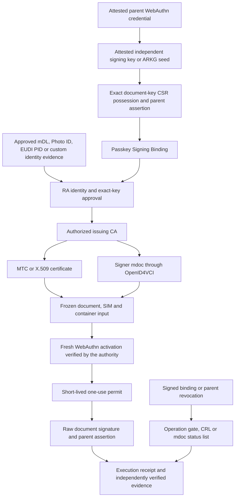

# Passkey-managed Personal Signing Credentials

CertConcord connects Passkeys to personal document certificates through a common RA, key-admission, issuance and evidence model. [PSCP](../spec/bindings/PSCP-draft-03.md) defines the associated signing-key profile. [DSCP](../spec/bindings/DSCP-draft-03.md) retains activation of independent ML-DSA, native and remote keys; [PRF-KPP](../spec/bindings/PRF-KPP-draft-03.md) retains local key protection and recovery.

## Complete flow



The native mdoc path uses an independently admitted holder DeviceKey for credential presentation. Its associated Passkey document key creates a distinct COSE signature. OpenID4VP, Annex C and the Digital Credentials API remain credential transports; ordinary presentation does not become document signing. A signing application must operate under the key's registered RP/origin or use an explicitly configured signing service at that origin.

## Relationship to the source proposals

| Source                                                                                                                             | Incorporated design                                                                                   | Required RRA composition                                                                                          |
| ---------------------------------------------------------------------------------------------------------------------------------- | ----------------------------------------------------------------------------------------------------- | ----------------------------------------------------------------------------------------------------------------- |
| [PassSign](https://github.com/codedpills/pass-sign/tree/4ae5a3d077040632b0885947b63329ba99413fb3)                                  | Distinct assertion evidence, remote activation and direct signing paths; explicit intent and receipts | Exact TBS, authoritative identity/key admission, one-use permits, status and acyclic evidence commitments         |
| [WebAuthn PR 2078](https://github.com/w3c/webauthn/pull/2078)                                                                      | A separately associated signing key exposed through WebAuthn                                          | Its historical `sign` wire is distinct from the selected version 4 and 5 wires                                    |
| [Yubico version 4](https://yubicolabs.github.io/webauthn-sign-extension/4/)                                                        | `previewSign` registration generation and assertion signing                                           | Signed algorithm, child attestation, fixed UV, CSR possession and raw signature in signed extension output        |
| [Version 5 snapshot](https://github.com/yubicolabs/webauthn-sign-extension/blob/812b911a2a5d737d2ebdb91ead8bfd78f8277710/index.bs) | `previewSign5`, including generation during an assertion and explicit extension errors                | A previously admitted parent inventory, exact snapshot selection and no automatic version downgrade               |
| [ARKG](https://github.com/Yubico/arkg-rfc/blob/8ddd04d27ef7ea479d372c7b8bdfecfdad0d1e1c/draft-bradleylundberg-cfrg-arkg.md)        | Public derivation of a document key without exposing the seed secret                                  | Enrollment-scoped context, exact ticket/algorithm binding, individual possession proof and individual RA approval |
| [WebKit Remote CryptoKeys](https://github.com/WebKit/explainers/tree/6ce73fa4f91bbe7fb1990b6c1e7276c8dbd12609/remote-cryptokeys)   | A platform-backed CryptoKey handle used through WebCrypto                                             | Separate admission and provider authorization; API nonextractability is not hardware attestation                  |

These sources retain their own status and byte conventions. RRA's binding and evidence requirements are defined by PSCP; they are not attributed to upstream certification programs.

## Execute the protocol examples

```sh
npm ci
npm run demo:passkey
npm run demo:passkey -- --v4 --split --mtc
npm run demo:passkey -- --arkg
npm run demo -- --identity=photoid --raw-passkey --v4 --split
npm run demo -- --identity=pid --raw-passkey --arkg
npm run demo -- --identity=custom --raw-passkey --direct --annex-c
```

The examples generate synthetic identities, test CA/attestation keys and software authenticator responses. They execute actual cryptographic verification, exact CSR construction, RA approval, MTC or X.509 issuance, and CMS or mdoc/COSE evidence verification. Device integrations replace `examplePasskey().credentials` with the supported browser/SDK interface and install the corresponding trusted attestation roots, model policy and status provider. The issuer never substitutes a software signing key when the platform API is unavailable.

## Integrate the boundaries

`PasskeySigningRegistry.begin()` returns a short-lived generation challenge. `stage()` checks both attestations and returns a real CSR input and possession challenge. `finish()` verifies the raw CSR signature and parent assertion and returns an admitted binding. `RegistrationAuthority` and `AuthorizedIssuer`/`MTCIssuer` require the configured registry for the new profile. `IdentityAdmission` and `PersonalMdocCA` use the same registry after external identity qualification.

The issuer and RA are independent trust roles even when their interfaces share a process in an example. A production registry lookup is an authenticated service boundary or an authorized local store. The client supplies evidence, never an authoritative `approved`, `attestationVerified`, `KAL2` or `GOOD` decision.

After the existing DSCP activation service issues a permit, `PasskeySigningService.begin()` reserves a request. `rawSign()` invokes the selected extension. `complete()` verifies the exact raw signature, signed parent output and current authority, then persists a signed receipt. Its `authorize` callback must evaluate the application-independent signing policy and current credential authority. Identical completed responses are retrievable; unresolved operations cannot be dispatched again.

`verifyPasskeyOperation()` verifies a single certified-key operation with externally supplied trust and status policy. `verifySignaturePackage()` composes it with document, SIM, CMS, certificate status and policy validation under `certconcord-ecp-cms-passkey-draft-03`. The native mdoc verifier uses `certconcord-ecp-mdoc-passkey-draft-03`. Both plans require the original raw-evidence object and an external binding-status resolver; an ordinary evidence plan rejects the new profile. Cryptographic validity, activation authority, key custody, algorithm assurance and trusted time remain separate results.

## Lifecycle and evidence portability

Signed binding changes stop key use immediately. Parent changes can disable all associated keys. The X.509/MTC branch merges revoked serials into a complete issuer CRL; the mdoc branch updates its signed status list. Issuers must publish those outputs through their normal authenticated status endpoints and retain prior status evidence for historical validation.

A replacement device or Passkey starts a new enrollment. The same SubjectID can be retained only after RA-authorized recovery. Original credentials, document signatures and evidence retain their original binding. The domain-separated binding commitment can be carried by MTC/X.509 or mdoc, while each issued representation has its own authorization, lifetime, identifier and status. This permits consistent verification across credential ecosystems without merging their trust chains.
