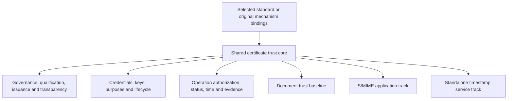

# CertConcord architecture — draft 03

Status: working draft. Normative language: English. The BCP 14 keywords MUST, MUST NOT, SHOULD and MAY express requirements only when capitalized. These requirements are proposed contracts for this draft, not a final standard.

## 1. Purpose

CertConcord defines an independently implementable certificate trust framework for qualifying subjects and keys, issuing purpose-bound credentials, accountable issuance, authorized cryptographic operations and independently verifiable evidence. The first complete application baseline is [document trust processing](document-baseline.md).

Research of original certificate structures, cryptographic constructions, signing and encryption flows, mdoc credentials and Passkey capabilities is core development alongside standards integration. An external standard is a source of mechanisms and interoperability contracts, not a ceiling on the framework's design. Conformance to an external standard can only be claimed for its actual selected requirements.

Mature standards and established ecosystem interfaces are adaptation and reference inputs across the framework. Original work specifies application capabilities and concrete gaps; it does not turn those dependencies into replacement-standard projects. Contributions to working drafts are distinguished from mature-standard integration by the [source classification](../docs/upstream-baseline.md).

## 2. Shared architecture

A profile MUST select a version of the shared core and identify its application rules and mechanism bindings. Different application schedules MUST NOT create incompatible meanings for the same subject, issuer, key, purpose, state transition or evidence identifier. A different trust domain may select different authorities; sharing a core does not require global trust in every issuer.

Governance duties are mandatory: explicit authority, role scope, delegation, qualification, accountability, continuity, revocation and emergency decisions. RRA/RA/CA is the first concrete composition. MTC is the first explored issuance/transparency architecture. Successors MAY change roles, proof structures, credential representation and interfaces if their complete contract, threat assumptions and verification rules are supplied.

Post-quantum security is a long-term core goal. Each path MUST identify which signatures, encryption secrets, identity sources, devices and archival dependencies have which classical, post-quantum or composite guarantees. A post-quantum issuer seal MUST NOT be described as converting a classical device signature into a post-quantum signature.

## 3. Mechanisms and representations

The shared semantics are subject, exact key, authorized purpose, issuer authority, validity/status, cryptographic suite and evidence dependencies. A certificate need not always be X.509. A native signer mdoc can be a certificate representation in its own right. A profile MUST define exact encoding, signature input, key binding, critical fields, interpretation and verification for its representation.

Security and the intended application can justify a dedicated verifier, client or plug-in. Compatibility profiles MUST declare their actual environment and limits. HTTPS-specific deployment compromises are not automatically inherited by document applications. Algorithms and structures may change through separately identified revisions; an incompatible construction MUST NOT reuse an existing identifier with a different meaning.

## 4. User and issuer independence

Wallets, authenticators, relying parties and issuers MUST have contracts definable independently of a particular ecosystem, implementation or service operator. EUDI, mDL, photoID and other ecosystems are optional mappings. Identity-source acceptance, issuer admission and document-signature acceptance are separate policy decisions; none implies either of the others.

Existing Passkeys can authorize selected operations. Research may also define certified signing capabilities associated with or provided by authenticators. A binding MUST distinguish these cases and MUST state the actual device and protocol support it requires. The framework does not mandate one physical-key arrangement across all future profiles.

## 5. Boundaries

The specification defines trust semantics and interoperable behavior. The reference code, wallet/provider examples and conformance materials make those contracts testable. Product UX, commercial operation, jurisdictional recognition and operational service deployment are separate responsibilities. An implementation MAY adopt the framework with independently operated infrastructure.

The first baseline includes necessary time evidence and historical verification, while a general timestamp issuing service is a separate application track. Email security likewise has separate message and address-binding rules. Both tracks reuse the same core instead of redefining it.

## 6. Evolution

Published drafts are immutable when cited by commit and content digest. Breaking changes are permitted while their new semantics, migration and historical verification scope are explicit. Retain original evidence bytes and their interpretation. A new runtime need not support every historical profile indefinitely; an archived verifier and declared retention period can provide the supported historical path. No unqualified backward-compatibility promise is made.

The [profile catalog](profiles.md), [conformance record](conformance.md), [research process](../docs/research.md) and [evolution policy](../docs/evolution.md) determine how candidates progress toward a stable specification. Neither a version number nor a successful demonstration substitutes for those gates.
