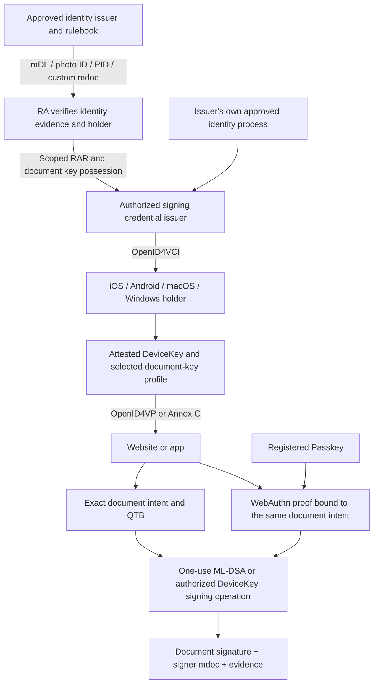
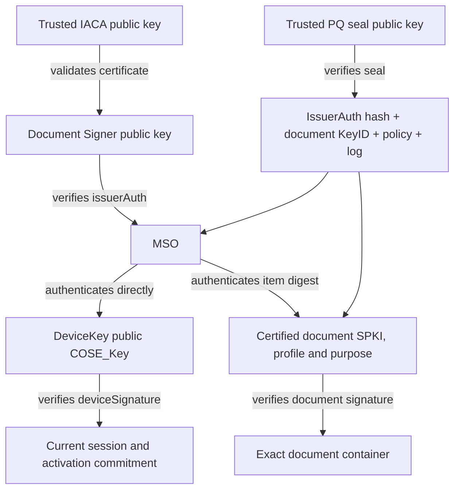

# CertConcord Digital Credentials Profile — draft 02

> Candidate binding for CertConcord draft 02. This is a working draft, not a final standard. Its requirements apply only when this binding is selected. The [draft architecture](../architecture.md) defines framework scope; the [profile catalog](../profiles.md) records applicability. The draft 02 namespace and wire domain identify experimental formats. Object schema numbers describe field layouts and do not indicate a stable edition.

Status: draft 02. Normative language: English.

## 1. Integrated architecture

Any issuer accepted by the domain's signing policy MAY issue personal signing credentials. Authority is scoped to an explicit trust policy, credential type and permitted purpose.

An RA may accept an mDL, photo ID, EUDI PID or approved custom mdoc as identity evidence under its issuer and rulebook policy. Document verifiers separately decide which signing credential issuers they trust. Accepting identity evidence does not import its issuer into the subsequent CA's certificate chain, appoint a subordinate CA or delegate document-signing authority.

| Form                           | Issuance responsibility                                                                   | Document verification                                                                           |
| ------------------------------ | ----------------------------------------------------------------------------------------- | ----------------------------------------------------------------------------------------------- |
| Evidence-based issuance        | An RA validates approved external identity evidence; its CA issues a personal signer mdoc | Trust the new signing issuer and retain the RA evidence commitment                              |
| Direct issuance                | An issuer with its own approved identity process issues a personal signer mdoc            | Trust that issuer for the signing profile; direct issuance uses the accepted issuer's authority |
| Combined identity/signing mdoc | The issuer signs identity namespaces and the RRA signing namespace in one MSO             | Evaluate each purpose separately; require the complete signing profile for document use         |



OpenID4VCI 1.0, OpenID4VP 1.0, selected HAIP 1.0 features and ISO/IEC 18013-7:2025 Annex C provide issuance and presentation transport. W3C Digital Credentials API mediates a chosen protocol at the browser/OS boundary; it is not a certificate format. OpenID and Annex C have distinct transcripts and encryption.

An ordinary identity-credential presentation does not authorize an arbitrary document signature. A signing-capable mdoc certifies a document public key, key mode and purpose. INDEPENDENT_PQ uses a separate ML-DSA key; DEVICE_KEY authorizes its P-256 holder key for a separate document-signing operation; PASSKEY_KEY uses an independently admitted Passkey-associated P-256 signing key. Issuer signature, holder proof and document signature are distinct objects. DSCP permits HUMAN_WEBAUTHN activation of the issued document key as well as HUMAN_MDOC; the chosen policy determines the proof required for each operation. PSCP requires HUMAN_WEBAUTHN preauthorization for its raw-signing operation, irrespective of any additional holder qualification.

## 2. Roles and trust registries

The Issuer Backend authenticates wallets, validates RA eligibility and holder proof, and issues a purpose-bound credential. The holder manages device keys, credential storage, consent and presentation. The verifier validates issuer trust, requested claims, holder binding, session binding and current status. The activation gateway decides whether the result authorizes a specific operation.

An issuer registry commits to issuer URL, certificate/SPKI, CA chain, allowed credential formats/types, RA scope, status location and authority key identifiers. A verifier registry identifies acceptable reader/request authorities and origin mappings. Registry updates are bound to RTM/policy state and retained for historical verification. A certificate found in an incoming x5c or COSE x5chain is not automatically trusted.

X.509 trust paths, validity, constraints, signature algorithms, key usages, critical extensions and status MUST be checked under the relevant ecosystem certificate profile. A trust anchor is excluded from x5c where OpenID requires exclusion. Request, wallet-attestation, key-attestation and credential certificates have distinct authorization roles even if an ecosystem shares their issuing hierarchy.

### 2.1. Key ownership and authentication relationships

Public and private keys are the two parts of a key pair. In the MSO, `deviceKeyInfo.deviceKey` is a **public COSE_Key**, never a private key, issuer key or certificate chain. Whether it also serves as the document key is explicitly fixed by the issued signing profile.

| Role                          | Private-key controller and operation                                                                         | Public-key location and verification                                                                                                            |
| ----------------------------- | ------------------------------------------------------------------------------------------------------------ | ----------------------------------------------------------------------------------------------------------------------------------------------- |
| IACA / issuer trust authority | Offline authority signs authorized Document Signer certificates and authority status material                | Locally accepted trust anchor and ecosystem chain; establishes which DS may issue the declared mdoc type                                        |
| Document Signer (DS)          | Issuer signs `issuerAuth`, a COSE_Sign1 authenticating MobileSecurityObjectBytes                             | DS certificate in the declared `x5chain`, validated to configured trust; the verification key MUST equal that certificate's SPKI                |
| DeviceKey / holder            | Wallet signs the current `DeviceAuthentication` transcript using its device private key                      | MSO `deviceKeyInfo.deviceKey`; trusted only after issuer authentication; proves possession for the requested presentation                       |
| Personal document signer      | Subject's approved local or remote signing provider signs exact document-container input after authorization | `org.certconcord.signer.1/signing_key` as DER SPKI, committed by the MSO's item digest and PQ seal; ML-DSA-65/87 or explicitly authorized ES256 |
| PQ credential-seal authority  | Registered issuer control authority signs `MdocCredentialSeal`                                               | Separately pinned ML-DSA-87 control certificate and purpose policy; attests to the mdoc/key/log association                                     |



Issuance MUST check possession for every registered key and the profile's key-equality or key-separation rule before certifying the association. A copied credential containing only public data is insufficient to produce a fresh holder proof or a document signature. Neither private key is an mdoc element; the issuer MUST NOT request either private key. The DS, RA and PQ seal keys MUST be distinct from subject keys. The holder and personal document keys MUST be distinct for INDEPENDENT_PQ and PASSKEY_KEY and MUST be the same P-256 key for DEVICE_KEY. PASSKEY_KEY additionally separates the document key from its WebAuthn parent and attestation key. A personal document key MUST NOT reuse the approving RA key. Equality is checked on normalized public SPKI, not on an alias or certificate subject name. A configured issuer public key inconsistent with the authenticated DS certificate MUST be rejected even if a signature verifies under that other key.

`deviceSigned` data is authenticated by the holder and MUST NOT be interpreted as a new issuer-certified claim. In particular, the activation commitment expresses transaction approval only under the RRA binding and gateway rules; it cannot change the issuer-certified subject, document key or permitted purpose. This profile selects `DeviceSignature`. Other ISO profiles can use `DeviceMac`; a MAC-based proof MUST NOT be presented as a publicly transferable document signature or silently substituted for this profile's signature requirement.

DPoP, wallet-attestation, reader/request-authentication and ephemeral response-encryption keys have separate protocol roles. They are not substitutes for the MSO DeviceKey or the certified personal document key. Native hardware possession does not imply local UV, proofing assurance or informed consent. Hardware claims require independently validated attestation; each operation's UV and consent require their own evidence.

Holder-key replacement requires a new MSO and credential: editing DeviceKey invalidates `issuerAuth`. Personal document-key replacement likewise requires a new certified signing-key value and PQ seal. DS rotation follows issuer certificate/status policy; old credentials retain their original verification material. No key replacement silently changes a previously signed document's identity or authorization history.

### 2.2. Key-attestation admission

Key admission is a mandatory transition in DTI section 4.3, before the CA certifies a DeviceKey. The issuer's hardware profile requires HARDWARE_KEY_VERIFIED. A deployment MAY explicitly select UNATTESTED for a software-key profile; that selection is bound into the signature policy, credential and verifier result and MUST NOT satisfy a hardware requirement.

The enrollment service creates an unpredictable, one-use challenge with a maximum 120-second lifetime. Its durable record binds TrustDomainID, SubjectID, profileID, policyHash, audience and the authenticated enrollment session. For INDEPENDENT_PQ and PASSKEY_KEY it also binds the existing document KeyID; PSCP admission precedes the PASSKEY_KEY holder association. For DEVICE_KEY, the document key is not known before hardware key generation: the record instead fixes CERTCONCORD-PERSON-DEVICE-SIGN-v1, and enrollment requires documentKeyID=holderKeyID after validating the attested public key. This prevents a requirement to attest a key before the issuance challenge exists.

The platform receives the challenge during key generation or certification. The verifier MUST compare the attested public key to the exact proposed DeviceKey, validate the manufacturer or enrolled attestation authority, the original signed evidence, freshness, security boundary, key-generation origin, permitted usage, platform policy and status. Local provider names and Boolean reports are not admission evidence. The RA signs the assessment's evidence hash and exact key/profile association. DeviceBinding enrollment independently revalidates that evidence and rejects inconsistent RA assertions. VCI issuance and activation MUST recheck the live binding and current attestation-authority status.

| Evidence adapter   | Signed relation and required checks                                                                                                                                                                                                                                                                            | Admission result                       |
| ------------------ | -------------------------------------------------------------------------------------------------------------------------------------------------------------------------------------------------------------------------------------------------------------------------------------------------------------- | -------------------------------------- |
| android-key        | Authorized attestation chain; exact leaf SPKI; first authoritative attestation extension from the root; UTF-8 challenge; matching attestation/KeyMint TEE or StrongBox level; generated P-256 signing key; application package/signing digests; locked verified boot; patch floor; current revocation material | ANDROID_TEE or ANDROID_STRONGBOX, KAL2 |
| apple-managed-acme | Apple Enterprise Attestation trust; ACME hardware-bound key's exact SPKI; freshness extension equal to SHA-256 of the device-attest-01 token; pinned device/OS property policy and status                                                                                                                      | APPLE_SECURE_ENCLAVE, KAL2             |
| tpm2-certify       | Independently enrolled AK; fresh TPM2_Certify; magic/type; qualifiedSigner; extraData=SHA-256(UTF-8 challenge); exact TPMT_PUBLIC Name and P-256 point; fixedTPM/fixedParent/sensitiveDataOrigin/sign attributes; unrestricted non-decrypt signing key; AK status                                              | TPM2, KAL2                             |

Android chain inputs are ordered leaf first. The certificate carrying the first attestation extension encountered from the trusted root MUST be the holder leaf in this profile; a descendant certificate cannot inherit that attestation. The service maintains both approved Google root generations when required by its pinned root policy. Revocation material is obtained by the server through the fixed authenticated service; a client-supplied GOOD flag is rejected. StrongBox and TEE are distinct policy choices. When per-use authentication is required, noAuthRequired is absent, hardware-enforced userAuthType is allowed and authTimeout is absent or zero.

Apple App Attest authenticates its own attestation key and application-bound data. Hashing another SecKey public key into its client data does not establish manufacturer attestation of that other key. DeviceInformation attestation likewise MUST NOT be substituted for attestation of the ACME identity key. A managed wallet MUST have authorized access to the exact attested ACME key and demonstrate holder/signing possession before enrollment. Lack of that access yields UNSUPPORTED_CAPABILITY. Secure Enclave generation alone remains UNATTESTED under this remote-admission model.

TPM AK enrollment requires EK credential activation against an accepted EK authority or an authenticated, audited hardware enrollment ceremony. A self-signed AK or an arbitrary AIK certificate is insufficient. The AK registry retains its public key, qualifiedName, enrollment method/evidence hash, status and validity. Windows Platform Crypto Provider metadata and the RSA-specific AD CS attestation flow MUST NOT be interpreted as an ES256 per-key proof. TPM key certification establishes key properties; measured boot and fresh user verification require additional evidence.

Secure Element implementations use an explicitly registered vendor evidence profile. An SE label, opaque key handle or mdoc API does not create a generic attestation format. A selected platform without a supported proof MUST fail the hardware profile; it MAY be separately enrolled only under an explicitly permitted lower-assurance policy.

Apple managed enrollment uses device-attest-01 under the pinned draft-10 profile. The ACME server MUST authorize the device inventory and enrollment reservation before generating the challenge. The challenge MUST be the same live DeviceBindingRegistry challenge, and the account, order, identifier, profile and final CSR MUST remain bound throughout the exchange. An invalid proof sets the challenge and authorization to invalid. The final CSR SPKI MUST equal the attested key. This profile uses an attested serial number or UDID as ClientIdentifier and permanent-identifier; exact bytes are compared without normalization. Arbitrary opaque ClientIdentifier mappings require another explicit identifier profile. Device identifiers MUST be omitted from the CSR and resulting enrollment certificate under this privacy profile. The authenticated enrollment service MAY select a fixed default profile on its dedicated ACME directory so native clients do not need to implement the ACME profiles extension. The issued management certificate enables access to the attested key; personal signing authority still requires the separate RA, DeviceBinding and signer-mdoc issuance transitions.

The TPM AK enrollment record MUST certify restricted signing, fixedTPM, fixedParent and sensitiveDataOrigin, and commit the independent EK credential-activation or audited hardware-ceremony evidence. A self-declared AK or unrestricted signing key MUST NOT authorize Certify evidence. The password-session CNG adapter supports keys whose PCP authorization permits that command; a different authorization policy requires an explicitly implemented TPM session adapter and cannot fall back to an unverified local report.

The assessment contains schemaVersion, format, policyID where applicable, holderKeyID, evidenceHash, assurance, keyAssurance, boundary, localUVPolicy, verifiedAt and expiresAt, with commitments to the trusted authority and status evidence. Assessment schema, exact key, time interval, assurance level, format/boundary relation and policy identifier MUST be validated by the credential verifier. Raw attestation chains, hardware identifiers and AK enrollment material remain access-controlled. The issuer-signed key_admission element carries the assessment; issuerAuth and MdocCredentialSeal commit it into the credential-to-document chain. Hardware assurance of DeviceKey MUST NOT be copied to an independent ML-DSA key.

### 2.3. Document-key profiles

| Profile                    | document_key_mode | Certified signing key  | Required relation                                                                                |
| -------------------------- | ----------------- | ---------------------- | ------------------------------------------------------------------------------------------------ |
| CERTCONCORD-PERSON-SIGN-v1         | INDEPENDENT_PQ    | ML-DSA-65 or ML-DSA-87 | Distinct from DeviceKey and all issuer/control keys                                              |
| CERTCONCORD-PERSON-DEVICE-SIGN-v1  | DEVICE_KEY        | P-256 / ES256          | Normalized signing_key SPKI equals MSO DeviceKey SPKI                                            |
| CERTCONCORD-PERSON-PASSKEY-SIGN-v1 | PASSKEY_KEY       | P-256 / ES256          | Independent of DeviceKey and the parent Passkey authentication key; PSCP admission and raw proof |

The issuer and relying party MUST explicitly enable the selected profile. No algorithm or assurance fallback is implicit. All profiles use the same RA, native-holder admission, VCI, permit and status framework; QTB applies when holder presentation activates signing. PASSKEY_KEY additionally requires [PSCP-draft-02](PSCP-draft-02.md), its separate document-key admission, preauthorized WebAuthn operation and mandatory raw-evidence ECP. A policy requiring post-quantum document signatures MUST reject DEVICE_KEY and PASSKEY_KEY. A PQ credential seal authenticating an ES256 key does not make its signatures post-quantum.

For PASSKEY_KEY, the issuer-signed signing namespace contains `passkey_binding` and its domain-separated `passkey_binding_hash`. The binding's SubjectID, TrustDomainID, policy and document SPKI MUST match the native signer claims. Its lifetime bounds credential validity. The holder DeviceKey remains independently admitted. Issuance through OpenID4VCI and presentation through OpenID4VP, Annex C or the Digital Credentials API do not change the Passkey's RP scope. `certconcord-ecp-mdoc-passkey-v1` requires the original parent assertion, registered parent public key and counter context in addition to the normal document evidence; the ordinary mdoc ECP cannot validate PASSKEY_KEY without this evidence.

DEVICE_KEY requires an application-accessible signature key capable of signing the exact RRA document COSE input. A platform that exposes only ISO DeviceAuthentication, DeviceMAC or a closed credential-presentation operation MUST reject this capability. Ordinary government credentials retain their issued purposes. A signer cannot reinterpret a presentation as a document signature or add a signing namespace after issuance.

## 3. Device enrollment and DeviceBinding

A holder key is generated on the target device. Its public key, algorithm and provenance are checked against policy; the issuer never needs its private key. ES256 signatures use P1363 in JOSE/COSE; a native DER ECDSA result is converted without changing the signed message. A platform key-generation or local hardware flag is recorded as a claim until independently verified attestation establishes a stronger KAL.

DeviceRegistrationAuthorization is an RA-signed control containing schemaVersion, trustDomainID, subjectID, profileID, holderKeyID, documentKeyID, policyHash, attestationEvidenceHash, keyAssurance, localUVPolicy, audience, issuedAt and expiresAt. An optional bindingExpiresAt separately limits the resulting binding; absent that field it equals expiresAt. The approval expiry governs enrollment and is not automatically the credential validity. The holder signs D("DeviceRegistrationProof", {schemaVersion:1, authorizationHash, nonce, audience}) with the new key. The server consumes both the nonce and approval hash exactly once, verifies the configured domain and audience, and bounds binding lifetime by policy.

DeviceBinding records schemaVersion, trustDomainID, bindingID, subjectID, holderKeyID, holderThumbprint, holderSPKI, documentKeyID, policyHash, authorizationHash, attestationEvidenceHash, keyAssurance, keyAdmission, localUVPolicy, profileID, epoch, status, createdAt and expiresAt. The binding enforces the selected profile's key-equality rule and expires no later than the assessment or policy permits. The challenge string is unpadded base64url; its exact text is signed in DeviceRegistrationProof.

The RRA credential issuer MUST create offers from this active registry and an authorized qualification policy. It MUST NOT accept caller-supplied subject/qualification claims as independent issuance authority. At credential issuance it MUST recheck the binding and compare the verified proof key to holderThumbprint. A token or pre-authorized code is insufficient for a different holder key. All proofs in a batch must satisfy the binding rule individually. A multi-device batch requires distinct authorized bindings and grants.

Each device receives a separate holder key and binding. Additional devices require enrollment approval. Biometric enrollment invalidation, device loss, key deletion or compromised attestation can revoke a binding and increment its epoch. Account recovery cannot silently transfer holder or document keys. Reissuance to a replacement device uses a new holder proof, new binding and new credential status index. Old evidence retains the original key and epoch.

## 4. Credential data model

The default personal signer document type and signing namespace are `org.certconcord.signer.1`. This RRA namespace is available to every conforming issuer; issuer trust remains an explicit policy input. A combined mdoc retains its ecosystem-authorized identity document type and namespaces and adds the signing namespace. The verifier MUST explicitly allow that document type for the issuer's signing purpose. A holder or intermediary cannot append an issuer-signed namespace to an existing MSO.

| Signing element                       | Type and rule                                                                           |
| ------------------------------------- | --------------------------------------------------------------------------------------- |
| trust_domain_id, subject_id           | Opaque 32-byte identifiers                                                              |
| credential_id                         | Independent random 32-byte value                                                        |
| signing_key                           | Original DER SPKI, ML-DSA-65/87 or profile-authorized P-256                             |
| signing_key_id                        | SHA-512 of that SPKI, 64 bytes                                                          |
| profile_id                            | CERTCONCORD-PERSON-SIGN-v1, CERTCONCORD-PERSON-DEVICE-SIGN-v1 or CERTCONCORD-PERSON-PASSKEY-SIGN-v1             |
| document_key_mode                     | INDEPENDENT_PQ, DEVICE_KEY or PASSKEY_KEY; consistent with profile and key equality     |
| passkey_binding, passkey_binding_hash | Required only for PASSKEY_KEY: PSCP binding and its 64-byte domain-separated commitment |
| key_admission                         | Issuer-authenticated assessment from section 2.2                                        |
| allowed_purposes                      | Explicit list containing DOCUMENT_SIGN                                                  |
| policy_hash                           | 64-byte RRA policy commitment                                                           |
| ra_authorization_hash                 | SHA-512 of the original signed RAR                                                      |
| device_binding_id, binding_epoch      | Current registry binding and integer epoch                                              |
| qualification                         | Assessed identity qualification                                                         |
| issuer                                | Exact registered issuer identifier                                                      |
| status                                | Issuer-pinned Token Status List reference and independent index                         |

IssuerSigned contains nameSpaces and issuerAuth. Each IssuerSignedItem has a digestID unique within its namespace, at least 16 random salt bytes, elementIdentifier and elementValue, wrapped as tag 24 bytes. SHA-256 covers the complete IssuerSignedItemBytes encoding. The MSO commits valueDigests for every namespace, deviceKeyInfo.deviceKey, docType and validityInfo. issuerAuth is COSE_Sign1 over MobileSecurityObjectBytes with the authorized issuer certificate. A complete issued credential includes every committed namespace and item; presentations may selectively disclose requested fields.

The base issuerAuth and holder suite is ES256. Personal signing credentials additionally require the ML-DSA-87 MdocCredentialSeal in section 12, delivered alongside the standard mdoc. It is an RRA extension, not an ISO-standard MSO extension. Wallets MUST retain it; document verifiers MUST validate it. The reference personal issuer defaults to one-day validity, bounded by DeviceBinding expiry and, for PASSKEY_KEY, PasskeySigningBinding expiry. The RRA status element is not imposed on government identity input.

The auxiliary qualification document type/namespace `org.certconcord.rra.1` remains available for access and compatibility. It does not itself certify a personal document key. Optional SD-JWT uses `https://github.com/CertConcord/framework/credentials/trust-qualification/v1`, cnf.jwk, SHA-256 disclosures, bounded lifetime/status and a verified KB-JWT nonce/audience/sd_hash. Duplicate/unreferenced disclosures and property overwrite are rejected. Auxiliary formats cannot silently acquire personal-signing semantics.

## 5. OpenID4VCI issuance

Issuer metadata advertises `certconcord_mdoc` and, when enabled, `certconcord_trust_qualification`. Each configuration declares its format, scope, document type/vct, binding algorithms and proof types. OAuth authorization-server metadata, signed issuer metadata, nonce, credential, deferred credential and notification endpoints are supported according to the advertised capabilities.

The primary flow uses authenticated PAR, authorization code, PKCE S256, exact registered redirect URI and authorization-response iss. The authorization decision is bound to the intended subject and offered configuration. A normal authorization-code offer MUST NOT be accepted as a pre-authorized code. When pre-authorized issuance is enabled, its independent grant, expiry, optional transaction-code policy and replay state are enforced. Transaction codes require attempt limits at the authenticated issuer boundary.

Access and refresh tokens are sender constrained using DPoP. Validate method, normalized endpoint, iat, jti, key thumbprint, nonce when required and access-token hash for protected resource calls. Clients handle DPoP-Nonce challenges from all applicable endpoints. Refresh-token rotation preserves the client, holder authorization and DPoP binding; it does not create a fresh RA issuance grant.

Credential requests prove possession with the configured proof type and issuer audience. A c_nonce is one-use and time bounded. Batch proofs are checked individually and each holder key receives its corresponding credential. A grant authorizes one issuance batch in this profile. A new batch or changed dataset requires another grant. Deferred responses retain the client, token authorization, encryption parameters and transaction state; a transaction ID alone is not authority. Notifications convey delivery outcome and do not retroactively authorize issuance.

Wallet attestation uses authenticated issuer-specific evidence and a fresh attestation PoP. Its subject identifies the wallet implementation as required by HAIP, not a globally unique wallet instance. Key-attestation validation checks the nonce, exact holder keys, attestation issuer trust, validity and required device properties. Hardware attestations may be transformed into the OpenID format only by an explicitly authorized service with retained source evidence and privacy controls.

Signed metadata has typ `openidvci-issuer-metadata+jwt`, sub matching credential_issuer, iat, a bounded exp and all metadata at top level. The wallet verifies the signer before using endpoint data. Endpoint origin and redirect policies MUST prevent untrusted metadata from becoming an arbitrary-fetch facility.

## 6. OpenID4VP presentation

Verifiers use DCQL with explicit credential format/type and requested paths. The RRA profile's paths for mdoc are [namespace, elementIdentifier]. The website requests only the attributes needed for its policy. An `aki` trusted_authorities constraint is matched against registered, validated issuer authority identifiers; it is not an instruction to trust an incoming arbitrary certificate.

For direct_post.jwt, requests are signed, retrieved from request_uri and use `x509_hash:` followed by the base64url SHA-256 of the request signer certificate. Responses use an ephemeral P-256 ECDH-ES key specific to the request and A128GCM or A256GCM. The verifier supports both encryption algorithms. The wallet prefers A256GCM when both are offered.

The verifier stores a fresh nonce, expiry, request encryption key, response state and originating browser session. A valid cross-device credential result is insufficient for a same-device session-bound operation: the wallet follows the returned redirect_uri, and completion must arrive in the original browser session with the one-use response code. A presentation cannot be redeemed from a different session.

Digital Credentials API mode uses `dc_api.jwt` and the browser/OS-provided origin. Signed requests check expected_origins. Unsigned requests derive their identity from the authenticated browser origin and ignore supplied client_id/expected_origins. Multi-signed requests use JWS JSON serialization with client_id and client-specific parameters in each protected header; the wallet verifies a signature under an applicable trust framework. An unprotected header cannot establish verifier identity.

DC API does not rely on the OAuth state parameter. Its response is associated with the originating API call/session and the credential nonce. A transport claiming DC API origin binding MUST receive that origin from the platform, not from an untrusted JSON request parameter.

The mdoc session transcripts are:

```
direct = [null, null, ["OpenID4VPHandover",
          SHA-256(CBOR([client_id, nonce, jwkThumbprintBytes, response_uri]))]]
dcapi  = [null, null, ["OpenID4VPDCAPIHandover",
          SHA-256(CBOR([origin, nonce, jwkThumbprintBytes]))]]
```

The thumbprint is the raw SHA-256 JWK thumbprint bytes, or null when the protocol permits no response encryption. This profile requires encryption. The device signature is a detached COSE_Sign1 over DeviceAuthenticationBytes, including the exact transcript, docType and DeviceNameSpacesBytes. Verification checks issuer digests, MSO validity, device key, requested fields and device signature. Undisclosed issuer-signed fields are not treated as absent from the issued credential.

## 7. ISO 18013-7 Annex C

The Digital Credentials API protocol is `org-iso-mdoc`. Its data contains base64url CBOR deviceRequest and encryptionInfo. The latter is `["dcapi", {nonce, recipientPublicKey}]`, with an ephemeral P-256 COSE public key and unpredictable nonce. The exact encryptionInfo base64url string participates in the transcript:

```
[null, null, ["dcapi", SHA-256(CBOR([encryptionInfoBase64url, origin]))]]
```

The request carries the ISO DeviceRequest/ItemsRequest structure. RRA reader authentication signs ReaderAuthenticationBytes containing that transcript and ItemsRequestBytes. The wallet validates reader authority and requested disclosure/retention policy before consent.

HPKE uses DHKEM(P-256, HKDF-SHA256), HKDF-SHA256 and AES-128-GCM. Its info is CBOR(SessionTranscript); its AAD is empty. Plaintext is the CBOR DeviceResponse. The response is `{response: base64url(CBOR(["dcapi", {enc, cipherText}]))}`. Origin, nonce, request and recipient-key substitution must fail cryptographic verification. This HPKE response is not an OpenID JWE.

## 8. Qualification Transaction Binding (QTB)

A verifier can qualify a subject without authorizing a signature. To authorize a document operation, it first freezes the COMMON ActivationContext. Its signed OpenID request includes one transaction_data item with type `urn:certconcord:activation:1`, credential_ids, activation_hash and display_text. activation_hash is the base64url H("ActivationContext", context). The holder must explicitly approve the transaction and includes the raw hash as device-signed `org.certconcord.rra.1/activation_hash`.

The verifier checks this device-signed value and consumes the successful presentation once for the same context and session. The gateway then requires an ACTIVE DeviceBinding, matching binding_epoch, holder thumbprint, SubjectID, document KeyID and acceptable qualification. It consumes the activation nonce and issues a HUMAN_MDOC permit. Revocation or device replacement between issuance and activation blocks use even when the credential signature remains valid.

QTB supplies SAL1 unless additional independently validated fresh UV and provider controls satisfy SAL2. Neither a client-supplied approval Boolean nor a biometric API label is remotely verifiable UV evidence. A human WebAuthn activation can accompany qualification when SAL2 is required. Trusted-display requirements remain separate.

## 9. Status, evidence and privacy

Credential status, DeviceBinding status, identity qualification, certificate revocation and document signature validity are related but separate states. Removing a credential does not delete a historical signature. Revoking a holder binding blocks new activations; it does not automatically imply that every earlier signed document is invalid. Incident evidence supplies the applicable effective interval.

Status references are resolved only through the issuer registry, with bounded responses and signed freshness checks. Status indices are independent and unpredictable. Prefer short-lived credentials and cacheable status material where privacy policy permits. A verifier must not contact an arbitrary URL from an untrusted credential.

The ECP records the exact request/response commitments, transcript, verified issuer evidence, applicable DeviceBinding epoch and the QTB/ACB linkage when required for historical authorization. Selective disclosure does not prevent correlation through a reused device key or signature. Wallets SHOULD use separate per-issuer/device credentials and issuer-supported batches; the service must not claim cryptographic unlinkability from claim minimization alone.

## 10. Conformance boundary

Each advertised flow MUST meet its pinned upstream profile. A deployment MUST provision the required wallet-provider registration, entitlements, origin association, issuer trust and device-attestation policy. An unavailable OS or browser capability MUST return UNSUPPORTED_CAPABILITY; fallback requires an explicitly selected supported profile.

## 11. External identity admission

The RA maintains a governed allowlist of identity issuers, DS certificates or validated authority identifiers, ecosystem roots, document types, namespaces, permitted claims, status methods, evidence age, assurance mapping and permitted uses. Identity intake trust is distinct from personal-signing issuer trust. Trust acquisition, replacement and revocation are authenticated administrative operations.

Each enrollment freezes TrustDomainID, policyHash, CSR hash, profile, original session commitment and nonce in IdentityEnrollment. A verified presentation is consumed once for that enrollment/session. The RA validates source eligibility, issuer/holder proof and requested identity claims against the proposed subject. The CSR proves the separate document key. Holder possession does not establish liveness, civil identity or legal eligibility by itself.

The retained status assessment MUST include its check time and a validity deadline bounded by the source's next update, credential expiry and the selected status validator's freshness limit. The RA MUST reject consumption after that deadline, including when status expires between response verification and enrollment approval. The CRL validator additionally bounds this deadline by its publication-age limit and the DS/issuer certificates' expiry.

External identity mdocs use their actual ecosystem schemas. They need not contain RRA issuer, status, qualification or key-binding claims. Each ecosystem pins its document type, namespaces, claim types and certificate-purpose rules. The complete-CRL admission adapter validates the Document Signer certificate's issuer, CRL signature, serial status, sequence, publication age and nextUpdate. A persistent sequence/digest watermark rejects rollback and equivocation. Other issuer-specific status methods require an explicitly enabled validator; missing/stale status cannot become GOOD.

The resulting RAR binds domain, target issuance audience, credentialFormat=mso_mdoc, SubjectID, identityAssurance, identityEvidenceHash, exact CSR/SPKI, profile, policy, possession mode and short validity. The CA checks every scope field and consumes it once for an offer. Identity evidence stays access controlled. Public credentials/logs contain minimal commitments, not a copy of government identity or biometric evidence. Account linking, duplicate resolution and reverification are explicit RA decisions.

### 11.1 Identity types and rulebooks

A configured identity profile MUST identify its rulebook version, exact case-sensitive docType, primary namespace, permitted namespace/element paths, claim types and applicable length bounds, certificate-purpose profile, status coverage and credential lifetime limit. An alias such as `photoid` or `eudi.pid` is a configuration label, never a replacement for the signed docType or namespace.

| Identity profile                           | docType                          | Namespace selection                                                                     |
| ------------------------------------------ | -------------------------------- | --------------------------------------------------------------------------------------- |
| ISO mDL                                    | `org.iso.18013.5.1.mDL`          | `org.iso.18013.5.1`                                                                     |
| Photo ID, selected Multipaz 0.100.0 schema | `org.iso.23220.photoid.1`        | Common elements in `org.iso.23220.1`; Photo ID elements in `org.iso.23220.photoid.1`    |
| EUDI PID, ARF 1.4.0 rulebook               | `eu.europa.ec.eudi.pid.1`        | `eu.europa.ec.eudi.pid.1`; additional domestic namespaces require explicit registration |
| Custom mdoc                                | Exact issuer-governed identifier | Each namespace and claim is explicitly registered under the issuer's permitted purpose  |

The request MUST select only approved `[namespace, element]` paths. The verifier MUST preserve namespace boundaries, validate disclosed values against the configured types and reject missing, duplicate, unrequested or mistyped claims. A matching field name in another namespace cannot satisfy a request. Mandatory attributes in a credential's issuance schema do not require blanket disclosure to every relying party.

The admission profile is committed as H("IdentityAdmissionProfile", normalizedProfile). The normalized fields are `id`, `docType`, `namespace`, `namespaces`, `certificateProfile`, `statusMode` and `maxCredentialLifetime`. The request and retained evidence MUST bind this commitment. Response verification and one-use RA consumption MUST recheck it against the currently authorized issuer profile; a change requires a new request. Policy authority, current issuer eligibility and the status validator remain separate mandatory checks.

The `ISO_MDOC` certificate profile uses the selected ISO Document Signer and Reader purposes. `EUDI_PID_ARF_1_4` uses the PID rulebook's Document Signer OID `1.3.130.2.0.0.1.2` and Reader OID `1.3.130.2.0.0.1.6`. That rulebook records an OID-registration dependency; these values are retained as an explicitly versioned profile. Profile selection MUST come from trusted issuer/reader configuration. A credential cannot choose its own accepted EKU or make a reader certificate valid for issuance. Unsupported path constraints or critical extensions fail the selected validation profile.

A custom type has only the identity assurance assigned by its approved issuance and verification policy. Its identifier, successful holder proof or similarity to a government schema MUST NOT confer government identity status. Direct or combined issuance MUST apply the full issuer rulebook and the RRA signing namespace independently. The [EUDI architecture mapping](../../docs/eudi-architecture.md) describes the wallet, trust and lifecycle boundaries associated with the selected PID reference.

## 12. Personal issuance, PQ seal and transparency

PersonalMdocCA checks the RAR, active DeviceBinding and exact holder proof. It rejects substituted keys, foreign domains, wrong audiences, unsupported profiles and expired/reused approvals. The personal profile permits one credential and holder proof per grant. A combined issuer supplies additional identity namespaces through its own authenticated policy callback, applying its ecosystem schema and issuance rules; untrusted requests cannot select those claims.

CredentialID is H("MdocIssuerAuth", ISO-CBOR(issuerAuth)). The original IssuerSigned representation is separately SHA-512 committed. An authorized ML-DSA-87 control certificate signs D("MdocCredentialSeal", {schemaVersion, trustDomainID, credentialID, issuerAuthHash, policyHash, documentKeyID, logProof, issuedAt, expiresAt}). issuerAuthHash is SHA-512 of that issuerAuth encoding. This authenticates the MSO commitments to holder key, document type, validity and signing-key/purpose elements. Base mdoc issuer trust and all disclosed digests still require validation.

The native log adapter is `certconcord-mdoc-issuance-log-v1`. Its exact entry is D("PersonalMdocLogEntry", {schemaVersion:1, trustDomainID, credentialID, raAuthorizationHash, documentKeyID, policyHash}). It uses the declared SHA-256 Merkle construction, signed checkpoints, consistency/inclusion proofs and independent durable mirror receipts. These are not draft-06 TBSCertificateLogEntry bytes and MUST NOT be labeled as MTC certificates. The X.509/MTC adapter remains available independently.

Log allocation commits in a separate journal before mirror publication. A failed quorum leaves an undelivered entry; an index is never reassigned. Identical entry retries reuse their index. Issuance requires the configured operator/key quorum at the same checkpoint. The bounded reference log permits 4,096 entries and 12 MiB; exhaustion requires governed log replacement and retained old proofs. Unavailability cannot lower the quorum.

The OpenID response carries `certconcord_credential_seal` as base64url CMS, preserved by encryption and deferred issuance. The wallet verifies and stores it with the credential before acceptance. The PQ seal does not make classical holder consent or external identity evidence post-quantum secure. Assurance is assessed separately for each plane.

## 13. Native document signature and evidence

Adapter `certconcord-mdoc-document-v1` signs detached COSE_Sign1 over the actual document payload using ML-DSA-65 (COSE -49), ML-DSA-87 (-50), or ES256 (-7) only for CERTCONCORD-PERSON-DEVICE-SIGN-v1. Protected headers include alg, content type application/certconcord-mdoc-document and critical labels urn:certconcord:context:1, urn:certconcord:sim:1, urn:certconcord:policy:1 and urn:certconcord:credential:1. Their values are D("SignatureContext", context), H("SIM", SIM), H("SignaturePolicy", policy) and SHA-512(original IssuerSigned). Context includes credentialType=MDOC. External AAD and unprotected headers are empty; the transported payload is null. ACB binds the full COSE Sig_structure as ADAPTER_MESSAGE before signing.

ES256 transports exactly 64 bytes of P1363 r||s. A provider's canonical DER signature is converted at the container boundary. ExecutionReceipt commits the provider's DER bytes, which the verifier reconstructs from P1363 before checking signatureHash. The signed COSE structure, critical context and document payload are distinct from ISO DeviceAuthentication; a presentation signature cannot be substituted.

Verification extracts the certified document public key and checks identity/purpose/policy, base mdoc, PQ seal, transparent issuance, status, validity, SIM, activation, permit, receipt and signature. No personal X.509 leaf is required; issuer/control certificates retain their infrastructure roles. PDF/CMS compatibility uses a separately approved X.509/MTC representation. Placing mdoc bytes inside CMS does not create an X.509 certificate.

The `certconcord-ecp-mdoc-attested-v1` plan contains Document, PersonalMdoc, CredentialSeal, CredentialStatusList, SIM, SignaturePolicy, ActivationContext, OperationPermit, ExecutionReceipt, COSE and VerificationPlan. The activation attestor is an explicit external trust input. Results distinguish documentKeyMode, documentAlgorithm, CLASSICAL or POST_QUANTUM documentAlgorithmAssurance, holderKeyAssurance, documentKeyAssurance, cryptographic validity, credential trust, ATTESTED_VALID activation, status, DECLARED_EXECUTION_TIME and COSE_PAYLOAD coverage. A software ML-DSA key remains KAL1 even when its holder key is KAL2. The verifier checks the policy's required holder admission and post-quantum requirement. A policy requiring trusted time remains INDETERMINATE until a validated timestamp/archive layer satisfies it.

## 14. Extension governance

An extension defines its own identifier, source lock, schemas, capability negotiation, signed transcript, state machine, critical processing and positive/negative vectors. An unchanged mDL/photoID, login or ordinary presentation cannot be treated as consent to unspecified documents. Unknown signing semantics fail closed. Issuers MAY select standalone or combined credentials within their explicitly authorized scope.

## 15. Assurance provenance, status coverage and mediation

Identity-source and wallet assurance are evaluated separately. The RA retains the source process, assessed policy, evidence commitment, time and known limitations. Claimed identity-proofing metadata is trusted only when authenticated by an accepted authority within scope; absent metadata stays unknown. RRA assurance identifiers do not assert NIST IAL or wallet certification equivalence.

An identity issuer's profile MUST select statusMode=ISSUER_AND_VALIDITY or PER_CREDENTIAL and an explicit maxCredentialLifetime in seconds. The former validates the issuer certificate status and actual MSO interval and records that individual revocation may not have been checked. A CRL for the Document Signer certificate produces coverage=ISSUER_CERTIFICATE and credentialStatus=NOT_PROVIDED. It MUST NOT be reported as individual-credential GOOD. PER_CREDENTIAL additionally requires verified issuer-provided individual status, coverage=ISSUER_AND_CREDENTIAL and credentialStatus=GOOD. Both modes reject known revocation, stale evidence and policy-exceeding validity. The assessment and policy are committed into the RA evidence.

The technical verifier and relying-party decision remain distinct, including when deployed together. Remote verifier assertions require authenticated authority, intended audience, purpose, request/session binding, result freshness and one-use consumption. A bare claims JSON response is insufficient for RA approval or signing activation.

| Selected route             | Carrier and cryptographic binding                                           | Conformance boundary                                          |
| -------------------------- | --------------------------------------------------------------------------- | ------------------------------------------------------------- |
| OpenID4VP direct_post.jwt  | Signed request, encrypted response, nonce and original-session completion   | Pinned OpenID4VP 1.0; no automatic ISO Annex B claim          |
| OpenID4VP dc_api.jwt       | Browser mediation, platform origin, OpenID DC API transcript and JWE        | Pinned OpenID4VP 1.0; no automatic Annex D claim              |
| ISO Annex C                | org-iso-mdoc, authenticated ItemsRequest, DC API origin transcript and HPKE | The locked 2025 Annex C profile and declared RRA extension    |
| Future harmonized protocol | Separately negotiated, versioned adapter                                    | Never aliases either existing transcript without verification |

Wallets distinguish disclosure, issuance and document-signing consent. A retry after expiry creates a new request and invalidates the old authority. The user must be able to review the intended issuer, recipient, attributes, signing identity and document intent without silent wallet/credential/transport replacement. Multi-credential composition requires an explicit plan binding each independently verified subject relationship; the 1.0 selected presentation adapter accepts one credential per request and does not implicitly merge identities.

[Credential ecosystem alignment](../../docs/ecosystem.md) provides informative context for these requirements.

### 15.1 Apple system-mediated presentment

Deployments integrating IdentityDocumentServices MUST register only document types authorized by their actual platform entitlement and maintain registrations with credential availability. Reader-authorizer identifiers, credential-issuer identifiers and holder/document public keys MUST retain their distinct trust roles. Per-symbol OS availability determines which provider and browser interfaces can be used.

The provider MUST compare the system-parsed disclosure request with the subsequently delivered raw request and independently validate reader authority, origin, transcript, requested claims, retention intent and current credential/key status before responding. Unsupported request versions or structures MUST fail the selected adapter. The [Apple integration contract](../../docs/apple-identity.md) identifies the protocol and platform boundaries.

System disclosure approval MUST NOT be treated as approval of an undisplayed or unvalidated SIM. If a platform exposes the raw RRA transaction only after disclosure consent, document signing requires a separately authenticated and reviewable approval bound to the exact ActivationContext. HUMAN_WEBAUTHN is one permitted composition. A holder presentation remains usable for RA identity evidence without granting document-signing authority.

## 16. Execution binding for signer mdocs

[EBP draft 02](EBP-draft-02.md) can supplement INDEPENDENT_PQ or explicitly selected DEVICE_KEY signing through an admitted broker. The issuer, holder, document key, admission authority and receipt authority retain their separate roles. `certconcord-ecp-mdoc-execution-draft-02` verifies the existing COSE document signature and complete native credential evidence plus the required provider admission and execution commitment. A normal presentation or an added unsigned namespace cannot enable this profile. PASSKEY_KEY retains its PSCP evidence requirements; unsupported plan composition fails explicitly.

The independent [mdoc Signing Certificates draft](../external/mdoc-signing/draft.md) owns the base credential, document-signature and key-relation contract. This application additionally requires its specified qualification, device admission, PQ seal, transparency, authorization and evidence rules. Base-only acceptance does not satisfy the integrated framework.
